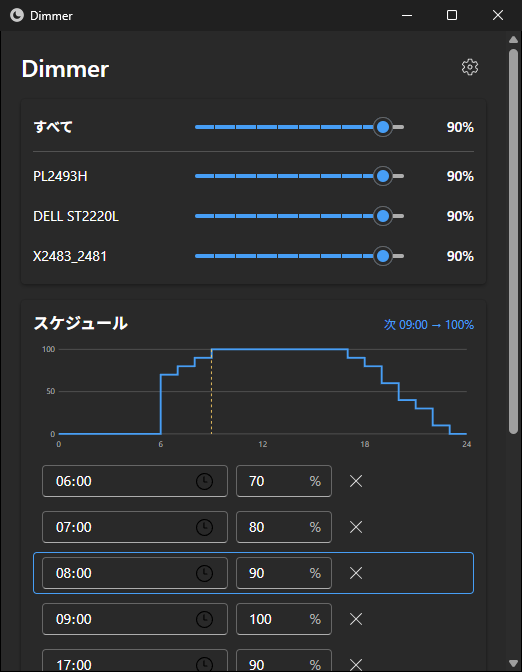

# Dimmer

GUI application to control luminance of monitors.



## ✨️ Features

- Manage the brightness of external monitors collectively or individually (DDC/CI)
- The schedule function automatically adjusts brightness at specified times
- Catches up after sleep, startup, or reconnecting a monitor: the brightness scheduled for the current time is applied automatically
- Runs in the system tray and can start automatically at login

## 📩 Download

Download the latest installer (`Dimmer_x.y.z_x64-setup.exe`) from the [releases](https://github.com/nigimitama/dimmer/releases) page.

## 💻️ Supported Platform

- Windows 11
- Windows 10

## 🛠️ Development

Requirements: Rust (stable), Node.js 22+, pnpm, Visual Studio Build Tools with the C++ workload.

```sh
pnpm install
pnpm tauri dev                     # run the app
pnpm lint && pnpm typecheck && pnpm test
cd src-tauri && cargo test         # run `pnpm build` first so that dist/ exists
pnpm tauri build --bundles nsis    # build the installer
```

Settings are stored in `%APPDATA%\io.github.nigimitama.dimmer\settings.json` and logs in `%LOCALAPPDATA%\io.github.nigimitama.dimmer\logs\`.

To release, push a tag such as `v1.0.0`; GitHub Actions builds the installer and creates a draft release.
